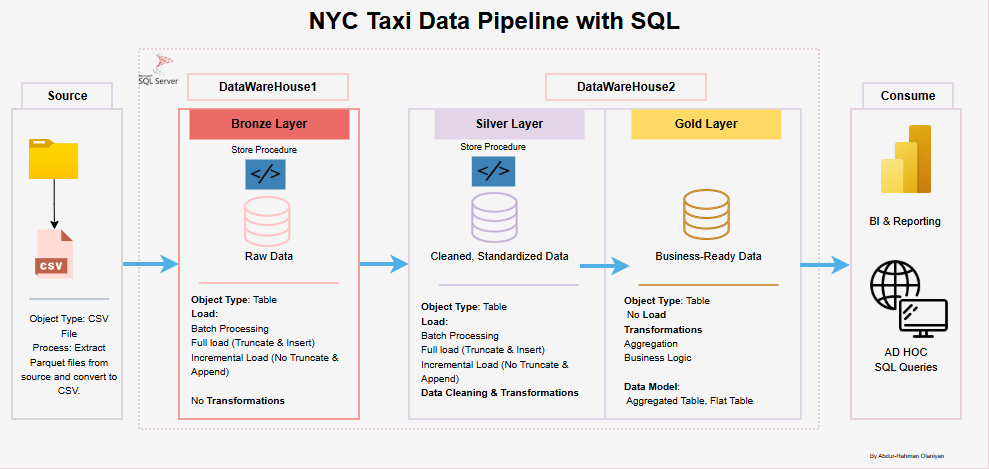

# NYC TAXI DATA PIPELINE

This project demonstrate the design and implementation of a simple, SQL based data pipeline that ingests, transforms, and aggregates NYC Taxi data for the year 2024. The pipelines compare both full refresh and incremental loading strategies.

----
# Data Architecture
----
The data architecture for this project follows Medallion Architecture **Bronze**, **Silver**, and **Gold** layers for both **Full Load** and **Incremental Load** Scenarios:

# Design Rationale

# Full vs. incremental load logic

# Metadata management for dynamic loading

# Example queries
-- Which vendor had the highest total revenue on the top 5 days in Q1 2024?
SELECT 
   TOP 5 TripDate,
    VendorName,
	COUNT(*) AS TotalTrips,
    SUM(TotalAmount) AS TotalRevenue
FROM Gold.nyc_tripdata_2024
WHERE TripDate BETWEEN '2024-01-01' AND '2024-03-31'
GROUP BY TripDate, VendorName
ORDER BY TotalRevenue DESC;

-- What is the average trip distance and duration per payment type in Q1 2024?
SELECT 
    PaymentType,
    ROUND(AVG(AvgDistance), 2) AS AvgTripDistance,
    ROUND(AVG(AvgDurationMins), 2) AS AvgTripDuration
FROM Gold.nyc_tripdata_2024
WHERE TripDate BETWEEN '2024-01-01' AND '2024-03-31'
GROUP BY PaymentType;
